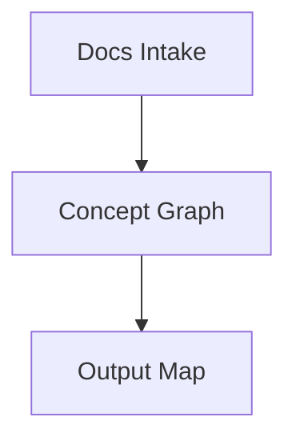

# Radicalizing Documentation UX (2026)

This document proposes a new documentation experience where diagrams, prose, and multimodal artifacts merge into a living, navigable knowledge graph. Mermaidman becomes the substrate; AI becomes the co-author.

## Thesis
Documentation is not a page. It is a space.

Users should navigate concepts spatially, expand depth on demand, and preserve provenance. The system should treat diagrams as the primary index, not a decorative output.

## Core UX Principles
- **Spatial first**: knowledge is laid out, not listed.
- **Infinite depth**: any node can open a nested diagram.
- **Multimodal by default**: images, video, audio, code, and datasets live as nodes.
- **AI as co-author**: the system suggests structure, not just text.
- **Deterministic storage**: everything is serialized back into Mermaid-compatible text.

## Primary User Flows
### 1) “Drop a doc, get a map”
1. User drops a PDF, README, or long prompt onto canvas.
2. Gemini extracts a concept graph and proposes a starter layout.
3. The graph is saved as Mermaid + directives.
4. User refines with drag-and-drop and AI suggestions.

### 2) “Zoom into a node to expand detail”
1. User double-clicks a node (e.g., “Authentication”).
2. A nested Mermaidman diagram opens with deeper sub-topics.
3. Breadcrumbs allow instant backtracking.
4. Parent node shows a live thumbnail preview.

### 3) “Explain or refactor a subgraph”
1. User lasso-selects a subgraph.
2. AI offers “Summarize”, “Refactor”, “Explain”.
3. Results are stored in `%% @ai:` directives.
4. User can accept or revise AI output.

## Windowed Explorer UX (User Stories)
### File explorer model
- As a user, I want a home view that feels like a Mac/Windows file explorer so I can scan saved diagrams quickly.
- As a user, I want “Recent”, “Starred”, and “Shared” filters to access my most-used diagrams fast.
- As a user, I want diagram thumbnails with last-opened timestamps so I can recognize documents at a glance.
- As a user, I want search by title, tag, or content snippet to find diagrams instantly.

### Windows, tabs, and active views
- As a user, I want each diagram to open in its own window so I can arrange multiple docs side-by-side.
- As a user, I want an option to open a diagram in a new tab instead of a new window.
- As a user, I want active window focus and tab stacks so I can manage multiple diagram contexts.
- As a user, I want a “View” that saves my current window layout so I can return to a working set.
- As a user, I want to reopen a saved View and restore window positions and sizes.

### Sticky note workspaces
- As a user, I want to spread diagrams around the canvas like sticky notes for spatial thinking.
- As a user, I want to save that spatial arrangement as a named View.
- As a user, I want to restore a View and continue editing without re-opening each doc.

### Drill-downs and navigation
- As a user, I want nested diagrams to open in new windows or tabs based on a preference.
- As a user, I want breadcrumbs across windows so I know where I am in the hierarchy.
- As a user, I want a “Back to parent diagram” action that preserves window state.

### Workspace persistence
- As a user, I want the app to remember my last open windows after refresh or restart.
- As a user, I want to close all windows and reopen the last session with one click.

## Killer UX Mechanics
- **Magnetic connectors** with AI-suggested labels.
- **Inline media nodes** (image/video/audio) with AI captions.
- **oEmbed nodes** for external media (YouTube, Vimeo, Figma, Miro, etc.) with safe sandboxing.
- **Code nodes** with auto language detection, formatting, and error badges.
- **Concept gravity**: AI suggests clustering and tidy layouts.
- **Semantic zoom**: at a distance, nodes collapse to titles; up close, they expand.

## Mermaidman Serialization (Backwards Compatible)
Mermaid stays pristine; metadata lives in comments:



## oEmbed Node Schema
Use `kind: "oembed"` with a URL. The system can resolve and cache the oEmbed payload.

```mermaid
%% @node: V {
%%   "uid":"n_9",
%%   "x":640,
%%   "y":120,
%%   "kind":"oembed",
%%   "oembed":{
%%     "url":"https://www.youtube.com/watch?v=dQw4w9WgXcQ",
%%     "provider":"youtube",
%%     "thumbnail":"https://img.youtube.com/vi/dQw4w9WgXcQ/hqdefault.jpg"
%%   }
%% }
```

Rendering rules:
- Prefer cached `html` if available; otherwise fetch via provider.
- Sanitize and sandbox embed HTML.
- Store thumbnails and metadata for fast canvas rendering.

## AI Integration Design (Gemini)
- **Ambient context**: AI watches selection + changes and suggests next actions.
- **Multimodal understanding**: AI extracts text from images, videos, and audio into node metadata.
- **Deterministic outputs**: AI results are stored with `model`, `prompt hash`, and timestamps.
- **Safe offline fallback**: local heuristics produce basic results when AI is unavailable.

## Data Model (High-Level)
- **Topology**: Mermaid edges and node IDs.
- **Canvas**: positions, types, styles, and media references in directives.
- **AI**: `%% @ai:` directives for provenance and regeneration.

## “Radical” UX Features
- **Graph-as-Doc**: export a diagram as a structured document.
- **Doc-as-Graph**: import any document to a graph with AI.
- **Live narratives**: record a walkthrough; embed as an audio node that auto-highlights nodes as it plays.
- **Collaborative prompts**: multiple users can attach AI intents to nodes, not just text comments.

## Success Metrics
- Time-to-first-map (seconds).
- % of docs that become navigable graphs.
- Reduction in stale documentation over time.
- Reuse rate of nested diagrams.

## Licensing and Trial UX (Buy Once, Use Forever)
This UX mirrors a "WinRAR-style" trial: the product remains usable indefinitely, but nudges intensify over time.

### Model
- **License**: one-time purchase, perpetual use.
- **Trial cadence**: soft trial cycles every 60 days.
- **Nudge cadence**: after 30 days, show a non-blocking purchase reminder.

### Behavior
- Day 0-29: no interruption.
- Day 30+: show a small modal/popup on app open (dismissible).
- Day 60: reset the "trial cycle" timer, but keep usage unblocked.

### UX Requirements
- Popup must be dismissible in one click.
- No feature gating for core editing.
- Keep copy short: value reminder + one purchase CTA.

### Analytics (optional)
- Track reminder views and dismiss rates.
- Track conversion after reminder exposure.

## Rollout Strategy
1. MVP: nested diagrams + code nodes + AI summaries.
2. Power features: multimodal ingest, semantic zoom.
3. Collaboration: event log + CRDT-ready ops.

## Why This Matters
Docs decay because they are linear and brittle. A graph with nested depth and AI co-authoring keeps knowledge alive, browsable, and maintainable. Mermaidman becomes a universal substrate for documentation that is readable by humans, parseable by machines, and navigable like a map.
